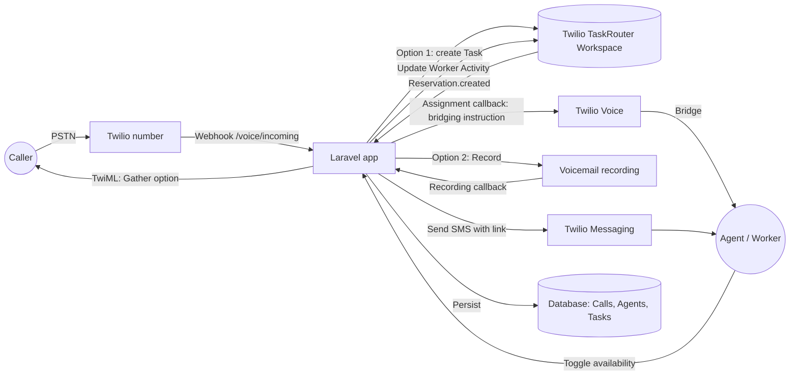

# Software Design Document (SDD)
## Simplified VoIP Application with Twilio TaskRouter

**Source document:** `docs/req.pdf` — *Senior Telephony Engineer Assessment*
**Version:** 1.0
**Status:** Initial draft

---

## 1. Purpose of this document

This SDD translates the assessment requirements into an actionable technical design: what
will be built, why, and how it is structured in terms of architecture, data, integrations
and flows, before implementation begins in PHP/Laravel.

## 2. Context

The client asked for a simplified VoIP application that lets an agent toggle their
availability and receive incoming calls routed through **Twilio TaskRouter** (not direct
dialing). When no agent is available, the caller must be able to leave a voicemail that is
sent to the agent by SMS. The exercise also assesses the ability to learn and defend a
system (Twilio Voice / TaskRouter) for which no prior experience is required.

## 3. Goals

### 3.1 Functional goals
1. **Agent availability:** allow toggling an agent between *available* and *unavailable*,
   reflected as a TaskRouter `Activity` and persisted locally.
2. **Receiving incoming calls:** accept incoming calls on a Twilio number and present them
   to the routing system.
3. **Call branching (minimal IVR):** offer the caller two options:
   - Route the call to an available agent.
   - Record a voicemail and send the agent an SMS with a link to the recording.
4. **Routing through TaskRouter:** every call directed at an agent must create a `Task`
   managed by a TaskRouter `Workflow`/`TaskQueue`, never a direct dial to the agent's
   number.
5. **Strict availability compliance:**
   - An `Unavailable` agent must not receive tasks or calls.
   - A caller with no available agents must not wait indefinitely (it must degrade to
     voicemail or a controlled timeout).
6. **Persistence and traceability:** model and store at least the `Calls` (with status,
   associated agent, outcome) and the state of agents and tasks locally (the app's own
   database), not only in Twilio.

### 3.2 Technical / integration goals
7. Correct and complete use of the required TaskRouter concepts:
   - **Workspace** as the container for the configuration.
   - **Activities** representing agent states (at least one available and one
     unavailable).
   - **Workers** representing the agent, with attributes relevant to routing.
   - A voice **Task Channel**, with the Worker's channel capacity configured correctly.
   - **TaskQueue** and **Workflow** to route the Task to an eligible Worker.
   - **Tasks** and **Task Reservations** created for each incoming call, used to bridge
     the caller with the Worker.
8. Real integration with Twilio: own account, rented number, credentials configured
   securely in the application.
9. Public exposure of webhooks through ngrok or an own server, to receive Twilio callbacks
   (voice, status callbacks, TaskRouter events).
10. Robust webhook and event handling: idempotency against duplicate deliveries, tolerance
    of out-of-order events, and correct handling after a call ends.

### 3.3 Quality and engineering goals
11. Clean, maintainable code aligned with Laravel/PHP good practice.
12. Error handling, input validation (Twilio payloads) and concurrency handling (for
    example, a race between an availability change and a Task assignment).
13. Test coverage (unit and, where applicable, integration tests simulating Twilio
    webhooks).
14. Clear technical documentation of the architecture and flow, plus a reproducible
    `README`.

### 3.4 Process goals / deliverables
15. Disclose the use of AI in an `AI_USAGE.md` (which tools, where and how they were used).
16. **Design ownership:** every decision must be explainable and defensible in a 45-minute
    review session, including failure scenarios and edge cases left unimplemented.
17. Public GitHub repository with instructions to reproduce the TaskRouter configuration.

## 4. Non-goals (out of scope)

- No sophisticated agent UI is required (beyond exposing the availability toggle and,
  optionally, accepting the call).
- No multi-tenancy or complex queues/skills beyond the minimum needed to demonstrate the
  TaskRouter concepts.
- No extensive IVR; only the two-option branch described above.
- No production infrastructure (load balancing, HA); ngrok or a personal server is enough
  for the purpose of this assessment.

## 5. High-level architecture

### Components
- **Laravel app:** exposes the webhook endpoints (`/voice/*`, `/taskrouter/*`), holds the
  business logic, and is the single source of truth for local state.
- **Twilio Voice:** handles the phone call (TwiML) and the bridging instructions towards
  the Worker.
- **Twilio TaskRouter:** the routing engine (Workspace, Activities, Workers, TaskQueue,
  Workflow, Tasks, Reservations).
- **Twilio Messaging:** sends the SMS with the voicemail link.
- **Local database:** persists `Calls`, `Agents/Workers`, `Tasks` and their state history,
  independently of the state held in Twilio (internal source of truth plus audit trail).

## 6. Data model (draft)

| Entity | Key fields | Notes |
|---|---|---|
| `Agent` | id, name, phone_number, twilio_worker_sid, status (available/unavailable) | Mirrors the Worker's Activity |
| `Call` | id, call_sid, from_number, status, agent_id (nullable), task_sid, outcome (routed/voicemail/abandoned), created_at | One row per incoming call |
| `Task` (local) | id, task_sid, call_id, workflow_sid, status, reservation_sid | Mirrors the lifecycle of the TaskRouter Task |
| `Voicemail` | id, call_id, recording_sid, recording_url, sms_sid | Links the recording to the SMS that was sent |

## 7. Main flows

### 7.1 Incoming call with an available agent
1. Twilio invokes the voice webhook; the app responds with TwiML containing a `<Gather>`
   offering the options.
2. The caller chooses "talk to an agent", and the app creates a `Task` in the voice
   Workflow.
3. TaskRouter evaluates eligible Workers (Activity = Available, free channel capacity) and
   creates a `Reservation`.
4. On the assignment callback, the app instructs the bridging between the caller and the
   Worker.
5. When the call ends, status callbacks move `Call`/`Task` to their final state.

### 7.2 Incoming call with no available agents / timeout
1. There are no eligible Workers, or the Workflow does not assign within the configured
   timeout.
2. The app reacts to the cancellation and redirects the waiting call to voicemail
   recording, avoiding an indefinite wait.
3. When the recording finishes, the `Recording` callback triggers the SMS to the agent with
   the link.

### 7.3 Availability toggle
1. The agent changes their state in the app.
2. The app updates the `Worker` (Activity) in TaskRouter and persists the change locally.
3. An `Unavailable` agent is excluded by the Workflow and receives no new Reservations.

## 8. Webhook and event handling

- Every webhook validates the Twilio signature (`X-Twilio-Signature`).
- Events are processed idempotently, using `call_sid`/`task_sid`/`reservation_sid` as
  deduplication keys, tolerating Twilio retries and out-of-order delivery.
- Events arriving after a call has ended (a final status callback, a late recording
  callback) must be able to update the record without creating inconsistencies or
  duplicates.

## 9. Security considerations

- Twilio credentials (Account SID, Auth Token, API Keys) managed through environment
  variables, never hardcoded or committed.
- Twilio signature validation on every webhook endpoint.
- Validation and sanitisation of received input (DTMF, callback parameters).

## 10. Testing and documentation strategy

- Unit tests for the business logic (agent state transitions, routing rules, TwiML
  construction).
- Integration tests simulating Twilio webhook payloads (voice, TaskRouter, recording,
  messaging).
- `README.md` with setup steps, environment variables, and how to reproduce the
  Workspace/Workflow/TaskQueue configuration in Twilio.
- `AI_USAGE.md` documenting the use of AI tools.

## 11. Acceptance criteria (derived from the "Considerations" section)

| Criterion | Covered by |
|---|---|
| Telephony concepts (routing, redirects, inputs, missed calls, messages, recordings) | Sections 7, 8 |
| Correct use of TaskRouter | Sections 3.2, 5, 7 |
| Webhook and event handling | Section 8 |
| Code quality | Section 3.3 |
| Logical structuring | Sections 5, 6, 7 |
| Good practice (errors, validation, concurrency, storage) | Sections 6, 9, 10 |
| Testing and documentation | Section 10 |
| Ownership of the subject | Section 3.4 |
